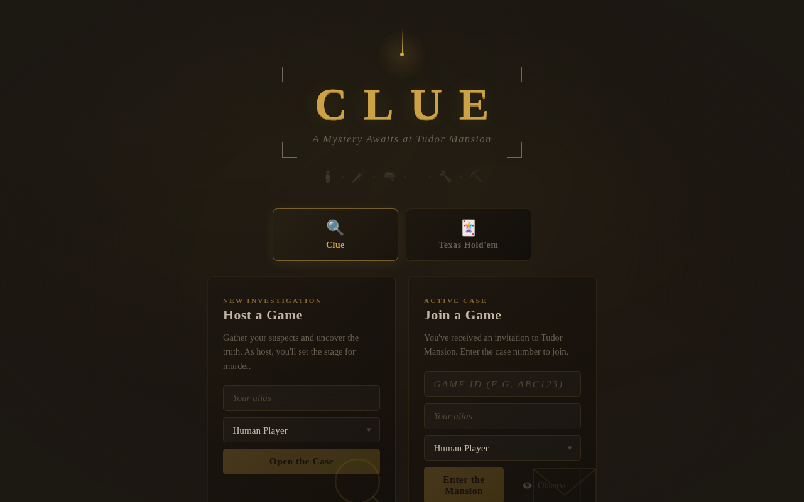
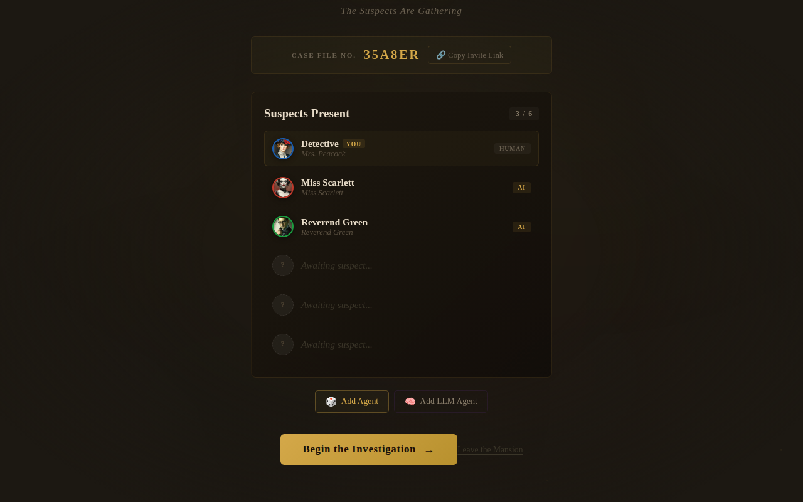
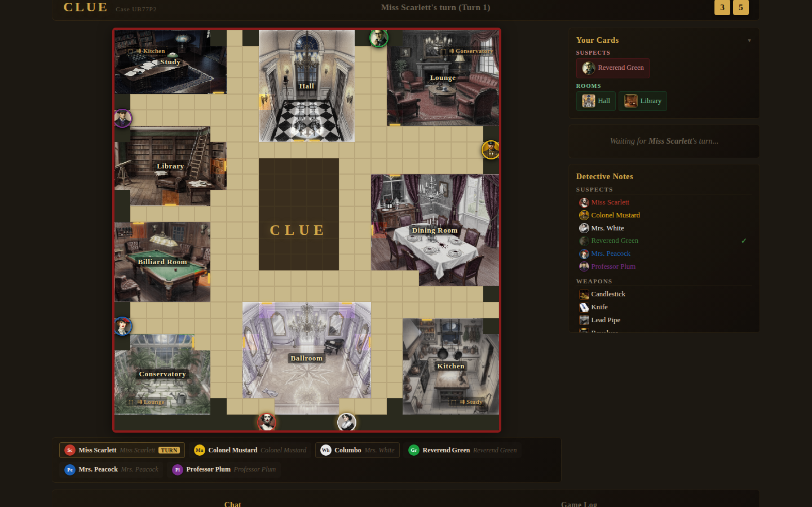
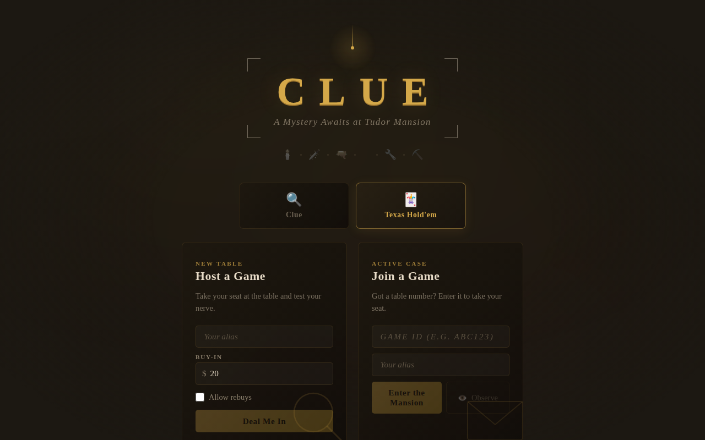
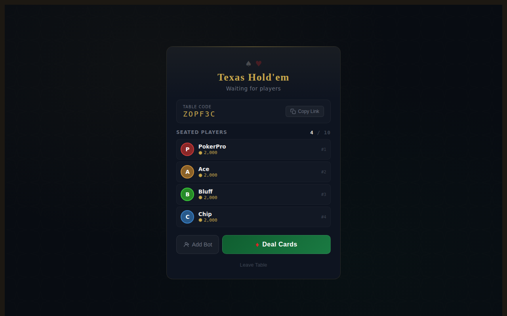
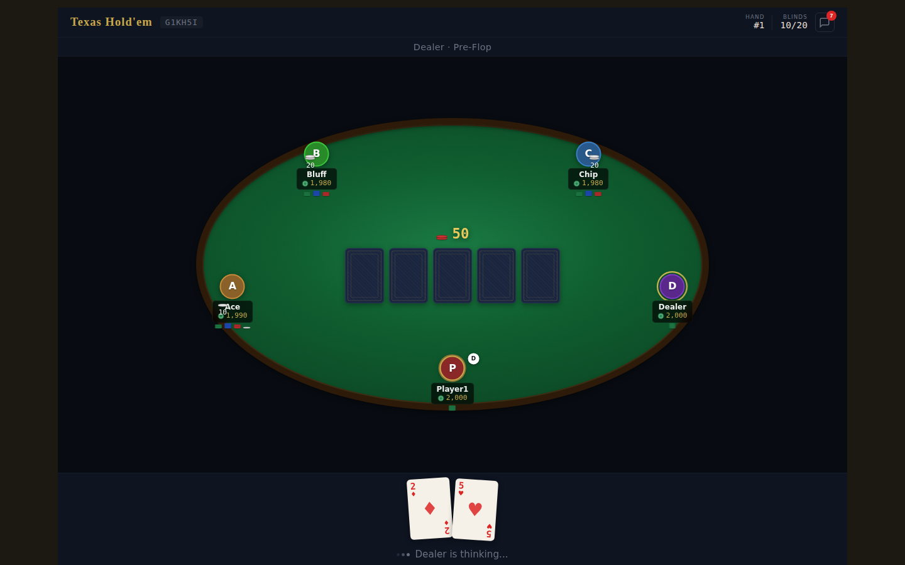

# Clue — Board Game Server

A real-time multiplayer game server supporting **Clue (Cluedo)** and **Texas Hold'em poker**, built with Vue 3, FastAPI, and Redis. Human players and AI agents compete in real time over WebSockets.

## Screenshots

### Clue

| Lobby | Waiting Room |
|-------|--------------|
|  |  |

| Game Board | Detective Notes |
|------------|----------------|
|  |  |

### Texas Hold'em

| Lobby | Waiting Room |
|-------|--------------|
|  |  |

| Poker Table |
|-------------|
|  |

## Features

### Clue
- Full Clue board with all 9 rooms, 6 suspects, and 6 weapons
- Cards dealt privately; suggestion resolution (other players show matching cards)
- Final accusations, player elimination, and solution reveal
- Real-time dice rolls, moves, suggestions, and accusations pushed to every player via WebSockets
- Human **and** AI agent players (`random`, `wanderer`, `llm`)
- Detective notes saved per player
- LLM agents with persistent memory and character-specific personalities

### Texas Hold'em
- Full Texas Hold'em poker with configurable buy-ins and blinds
- Betting rounds: preflop, flop, turn, river, showdown
- All-in support with side pots
- Rule-based AI opponents (`holdem_agent`)
- Re-buy support

### General
- Short shareable game IDs (e.g. `ABC123`)
- Real-time updates via WebSockets for all players
- Move log recorded in Redis for every action
- 24-hour TTL on all game state

## Quick Start

### Docker Compose (recommended)

```bash
docker compose up
```

| Service | URL |
|---------|-----|
| Frontend (Vite HMR) | http://localhost:5173 |
| Backend API | http://localhost:8000 |
| Redis | localhost:6379 |

Code changes in `backend/` and `frontend/src/` are reflected immediately without rebuilding.

### Manual Setup

#### Backend

```bash
cd backend
pip install .              # or: uv sync
uvicorn app.main:app --reload
```

Requires a local Redis instance at `redis://localhost:6379`.  
Set `REDIS_URL` to override. Set `CORS_ORIGINS` to restrict CORS in production.

#### Frontend

```bash
cd frontend
npm install
npm run dev        # dev server with HMR — proxies /games and /ws to :8000
npm run build      # builds into backend/static/ for production serving
```

### Tests

```bash
cd backend
pytest tests/ -v
```

Tests use `fakeredis` — no running Redis instance needed.

## Debug Scripts

Inspect game state, cards, memory, chat, and agent trace directly from Redis:

```bash
# List active games
python scripts/dump_game.py --list-games

# Dump a game with cards + memory
python scripts/dump_game.py ABC123 --show-cards --show-memory

# Include recent agent trace entries (most recent first)
python scripts/dump_game.py ABC123 --show-trace

# Limit trace output size
python scripts/dump_game.py ABC123 --show-trace --trace-limit 100
```

## Git Pre-Push Thumbnail Hook

Keep generated thumbnail assets in sync automatically before every push.

```bash
# one-time per clone
./scripts/install_git_hooks.sh

# optional manual run
./scripts/resize_thumbnails.sh
```

The `pre-push` hook runs thumbnail generation and blocks the push if files changed, so you can commit the regenerated assets first.

## Taking Screenshots

A Playwright-based script captures screenshots of all game states for documentation:

```bash
# Install dependencies (from repo root)
npm install
npx playwright install chromium

# Start the game server first
docker compose up -d   # or start backend + frontend manually

# Capture screenshots (saved to screenshots/)
node scripts/take_screenshots.js

# Custom server URL or output directory
node scripts/take_screenshots.js --base-url http://localhost:5173 --out screenshots/
```

## Kubernetes Deployment

Build, push, and deploy with the helper script:

```bash
./scripts/deploy.sh -r ghcr.io/<owner>/clue -t <tag>
```

Deploy via SSH to a remote machine with `kubectl` configured:

```bash
./scripts/deploy.sh -r ghcr.io/<owner>/clue -t <tag> --ssh <user>@<host>
```

Enable cert-manager TLS (Let's Encrypt):

```bash
./scripts/deploy.sh -r ghcr.io/<owner>/clue -t <tag> --ssh <user>@<host> --cert-manager
```

Use `--skip-build` to only apply manifests and update image tags without rebuilding.

The `k8s/` directory contains:

| File | Description |
|------|-------------|
| `redis.yaml` | Redis Deployment and ClusterIP Service |
| `backend.yaml` | FastAPI backend Deployment and ClusterIP Service |
| `ingress.yaml` | Ingress routing `/games`, `/holdem`, `/ws` to backend; `/` to frontend |
| `clusterissuer.yaml` | cert-manager `ClusterIssuer` (Let's Encrypt) for TLS |
| `ingress.yaml`       | Ingress for `clue.melloy.life`, routing `/games` and `/ws` to backend, `/` to frontend |

Update the ACME email in `k8s/clusterissuer.yaml` before first deploy when using cert-manager.

## API

### Clue

| Method | Path | Description |
|--------|------|-------------|
| `POST` | `/games` | Create a new game |
| `GET`  | `/games/{id}` | Get game state |
| `GET`  | `/games/{id}/player/{player_id}` | Get player-specific state (cards, actions) |
| `POST` | `/games/{id}/join` | Join a game |
| `POST` | `/games/{id}/start` | Start the game and deal cards |
| `POST` | `/games/{id}/action` | Submit an action (`move`, `suggest`, `accuse`, `show_card`, `end_turn`) |
| `POST` | `/games/{id}/add_agent` | Add an AI agent player |
| `PUT`  | `/games/{id}/notes` | Save detective notes |
| `WS`   | `/ws/{id}/{player_id}` | WebSocket for real-time updates |

### Texas Hold'em

| Method | Path | Description |
|--------|------|-------------|
| `POST` | `/holdem/games` | Create a new Hold'em table |
| `GET`  | `/holdem/games/{id}` | Get table state |
| `GET`  | `/holdem/games/{id}/player/{player_id}` | Get player-specific state (hole cards, actions) |
| `POST` | `/holdem/games/{id}/join` | Join a table |
| `POST` | `/holdem/games/{id}/start` | Deal cards and start the first hand |
| `POST` | `/holdem/games/{id}/action` | Submit an action (`fold`, `check`, `call`, `bet`, `raise`, `all_in`) |
| `POST` | `/holdem/games/{id}/add_agent` | Add an AI bot player |
| `WS`   | `/ws/holdem/{id}/{player_id}` | WebSocket for real-time updates |

## WebSocket Message Types

### Clue

| Type | Direction | Description |
|------|-----------|-------------|
| `game_state` | server→client | Full game state snapshot |
| `player_joined` | server→all | New player joined |
| `game_started` | server→all | Game started; cards dealt |
| `player_moved` | server→all | Player moved to a new position |
| `dice_rolled` | server→all | Dice result and reachable positions |
| `suggestion_made` | server→all | Suggestion made |
| `card_shown` | server→suggester | Which card was shown privately |
| `card_shown_public` | server→all | A card was shown (no card details) |
| `show_card_request` | server→player | Player must reveal a matching card |
| `accusation_made` | server→all | Accusation made |
| `game_over` | server→all | Game over with winner and solution |
| `your_turn` | server→player | Notify active player it's their turn |
| `auto_end_timer` | server→all | Countdown before auto-ending idle turn |
| `chat_message` | server→all | Chat message |
| `agent_debug` | server→all | Agent decision debug info |
| `ping` / `pong` | client↔server | Keep-alive |

### Texas Hold'em

| Type | Direction | Description |
|------|-----------|-------------|
| `game_state` | server→all | Full table state after each action |
| `chat_message` | server→all | Table chat message |
| `ping` / `pong` | client↔server | Keep-alive |

## AI Agents

### Clue Agents

| Type | Description |
|------|-------------|
| `agent` (RandomAgent) | Rule-based: moves toward unknown rooms, suggests unknown cards, accuses when solution is narrowed down |
| `wanderer` (WandererAgent) | Ambient character that rolls and moves to random rooms; never accuses |
| `llm_agent` (LLMAgent) | Calls an OpenAI-compatible API with character-specific prompts; falls back to RandomAgent on failure |

### Hold'em Agents

| Type | Description |
|------|-------------|
| `holdem_agent` | Rule-based: evaluates hand strength (pair, flush, straight, etc.) and adjusts betting accordingly |

## Environment Variables

| Variable | Default | Description |
|----------|---------|-------------|
| `REDIS_URL` | `redis://localhost:6379` | Redis connection URL |
| `CORS_ORIGINS` | `*` | Allowed CORS origins |
| `AGENT_MODE` | `inline` | `inline` (agents run in-process) or `external` (agent runner process) |
| `DEBUG` | `false` | Enable Uvicorn auto-reload |
| `LOG_LEVEL` | `INFO` | Logging level |
| `LOG_FORMAT` | `colored` | `colored`, `json`, or `plain` |
| `LLM_API_KEY` | _(empty)_ | OpenAI-compatible API key for LLM agents |
| `LLM_API_URL` | `https://api.openai.com/v1/chat/completions` | LLM API endpoint |
| `LLM_MODEL` | `gpt-5-mini` | LLM model name |
| `BACKEND_URL` | `http://localhost:8000` | Backend URL (used by agent runner and frontend proxy) |

